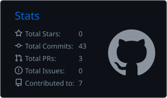
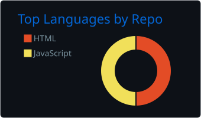
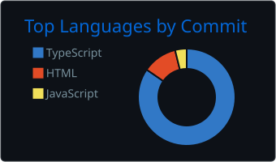
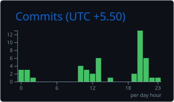

  

  

👋 HEY THERE, I'M ARYAN SINGH
💻 FULL-STACK DEVELOPER • BUILDER • PROBLEM SOLVER

<table> <tr> <td width="60%" valign="top">

🚀 ABOUT ME
💻 Full-Stack Developer passionate about building web applications

⚡ Love turning ideas into practical digital products

🌱 Constantly improving my development skills

🧠 Interested in modern web technologies and scalable applications

🔧 I enjoy building, experimenting and solving problems

🚀 Always learning and exploring new technologies

🎯 CURRENT FOCUS
Frontend Development   ████████████████████░  90%
Backend Development    ████████████████░░░░  80%
Database               ███████████████░░░░░  75%
Problem Solving        ████████████████░░░░  80%
Learning New Tech      ███████████████████░  85%
</td>

<td width="40%" align="center">

</td> </tr> </table>

💻 TECH STACK

🌐 FRONTEND

  

⚙️ BACKEND & DATABASE

  

🛠️ TOOLS & DEVELOPMENT

📚 CURRENTLY LEARNING

  

Building stronger full-stack applications and improving backend architecture.

📊 GITHUB STATS

 

  

 

🔥 GITHUB STREAK

📈 CONTRIBUTION ACTIVITY

🐍 CONTRIBUTION SNAKE

🚀 FEATURED PROJECTS

 

<table align="center"> <tr> <td width="50%" valign="top">

🌐 GITHUB BASICS
HTML-based learning and GitHub fundamentals project.

Tech: HTML

<a href="https://github.com/ARYANBUILDS707/github-basics">VIEW PROJECT →</a>

</td>

<td width="50%" valign="top">

💳 PAYMENT BACKEND TESTING
JavaScript project focused on backend/payment testing work.

Tech: JavaScript

<a href="https://github.com/ARYANBUILDS707/Payment-Backend-Testing">VIEW PROJECT →</a>

</td> </tr> </table>

🧩 WHAT I BUILD

💡 AREA	🔥 FOCUS
🌐 Web Development	Modern & responsive web applications
⚛️ Frontend	React / Next.js interfaces
⚙️ Backend	Node.js / Express APIs
🗄️ Database	MongoDB applications
🔐 APIs	Backend integration & testing
🚀 Projects	Real-world products & experiments

⚡ DEVELOPER MODE

╔══════════════════════════════════════════════════════╗
║                                                      ║
║   CODE → BUILD → BREAK → DEBUG → LEARN → REPEAT    ║
║                                                      ║
╚══════════════════════════════════════════════════════╝
💙 BUILDING THE FUTURE, ONE COMMIT AT A TIME.

🌐 CONNECT WITH ME

💻 CODE • CREATE • SHIP • REPEAT

